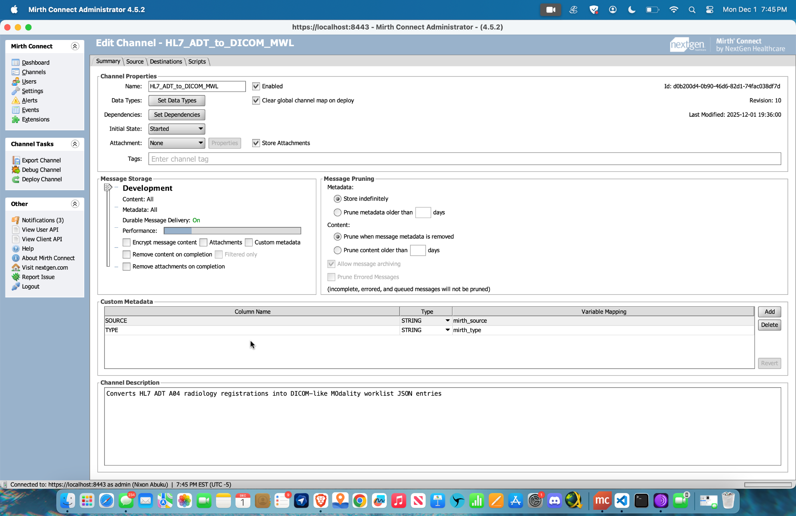
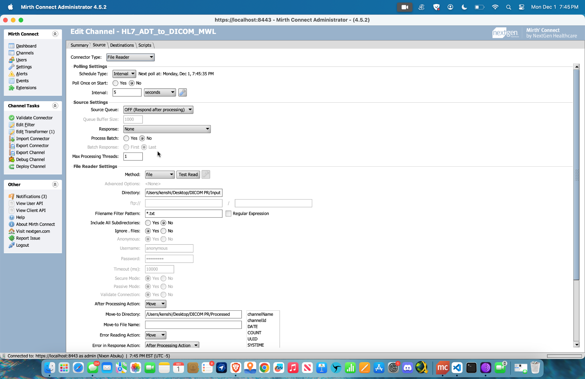
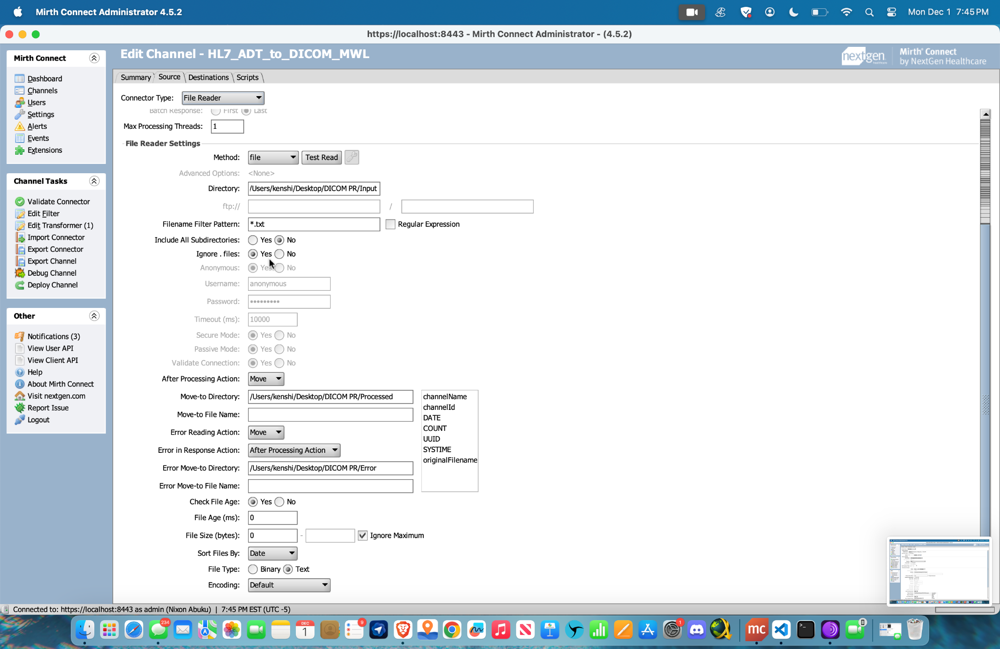
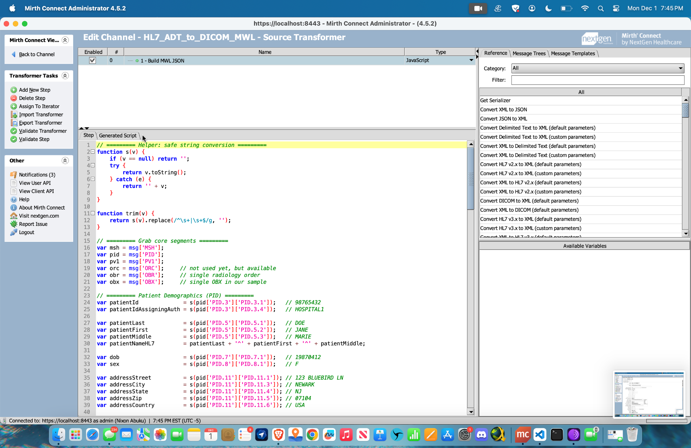
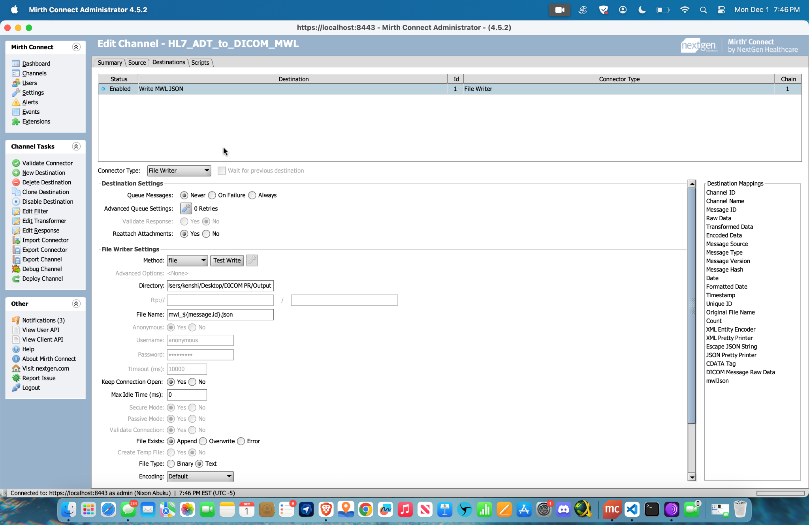
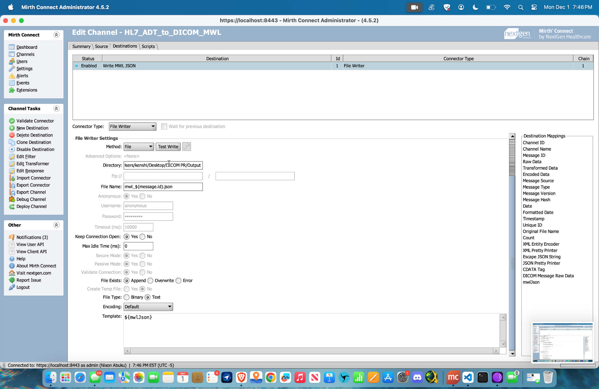
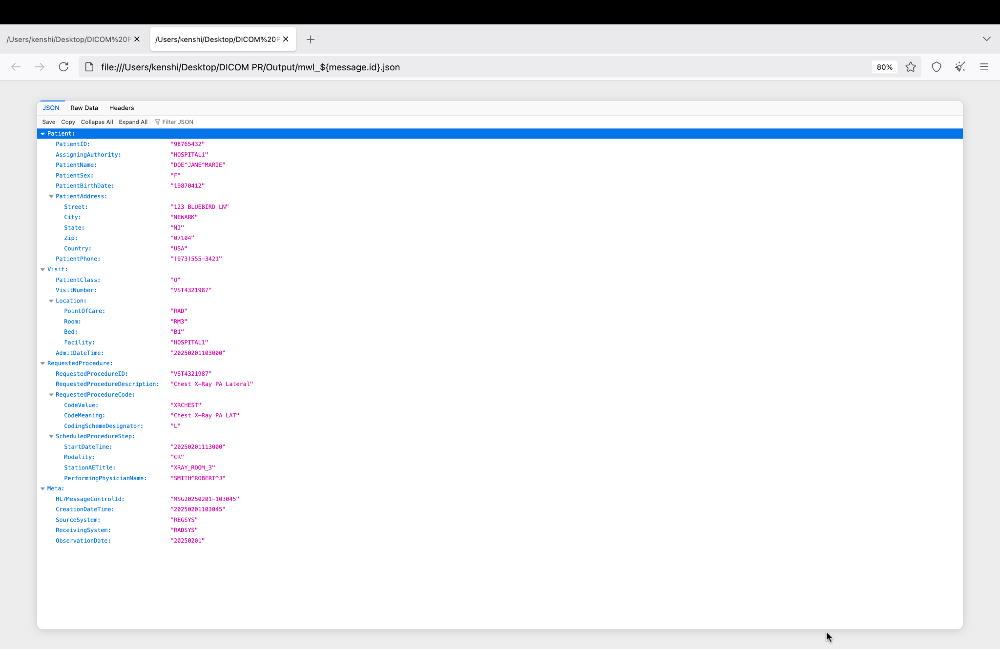

# 📘 HL7 ADT A04 → DICOM Modality Worklist (MWL) Transformation  
*A production‑quality Mirth Connect project for converting HL7 v2.x Radiology Registration messages into structured DICOM MWL‑style JSON.*

---

## 🔎 Overview

Modern imaging systems rely on **DICOM Modality Worklist (MWL)** to automatically pull patient, visit, and procedure information into modalities such as **X‑Ray, CT, MRI, and Ultrasound**.  
However, many hospital systems primarily communicate via **HL7 v2.x ADT/ORM messages** — which creates a gap.

This project implements a clean, maintainable, and professionally structured **HL7 ADT A04 → MWL JSON transformation** using **Mirth Connect**, mirroring real‑world radiology workflow integrations performed in hospitals and imaging centers.

---

## 🚀 What This Project Provides

- **Full HL7 → MWL JSON transformation** using a custom JavaScript transformer in Mirth Connect  
- **Accurate extraction** of demographic, visit, order, and observation details  
- **MWL‑style JSON output** structured to match real‑world DICOM MWL worklist requirements  
- **Clean, organized repository structure** for recruiters and engineers  
- **Complete Mirth channel export (.xml)** for instant import  
- **Screenshot‑documented configuration** of:
  - Channel summary  
  - File reader  
  - Transformer  
  - File writer  
  - Output validation  

This project reflects a **professional, production‑ready integration** rather than a simple tutorial script.

---

## ⚙️ Architecture Flow (High-Level)

```
HL7 ADT A04 Message (.txt)
      ↓
Mirth Connect Channel
      ↓
Source Connector: File Reader
      ↓
JavaScript Transformer
      ↓
MWL JSON Builder (channelMap.put)
      ↓
Destination Connector: File Writer
      ↓
Output JSON Worklist Entry
```

---

## 📁 Repository Structure

```
hl7-adt-to-dicom-mwl/
│
├── README.md
│
├── src/
│   └── transformer.js
│
├── channel/
│   └── HL7_ADT_to_DICOM_MWL.xml
│
├── sample-hl7/
│   └── ADT_A04_Radiology_Registration.txt
│
├── sample-output/
│   └── mwl_sample_output.json
│
└── screenshots/
    ├── channel_summary.png
    ├── file_reader_settings.png
    ├── file_reader_settings_part2.png
    ├── transformer_code.png
    ├── file_writer_settings.png
    ├── file_writer_template.png
    └── output_json_preview.png
```

---

## 🖼️ Screenshot Documentation (Inline with Descriptions)

### **1. Channel Summary**


This view outlines the channel’s metadata, message storage configuration, pruning policy, and custom metadata fields. It demonstrates proper professional setup for a production HL7 interface.

---

### **2. File Reader – Part 1**


The File Reader is configured to ingest HL7 `.txt` files from the project input directory.  
Key items demonstrated:
- Interval polling  
- Source queue handling  
- Clean file movement (Processed/Error)  

---

### **3. File Reader – Part 2**


Advanced file handling settings and move-to directories are shown here.  
This ensures:
- Error isolation  
- Consistent processing  
- Predictable file lifecycle  

---

### **4. JavaScript Transformer**


Custom JavaScript logic extracts PID, PV1, OBR, and OBX information from the HL7 v2 message and constructs a DICOM MWL-style JSON object.  
This is the core engine converting a registration into an MWL worklist entry.

---

### **5. File Writer – Destination Configuration**


The File Writer outputs structured MWL JSON files using a safe filename pattern:
```
mwl_${message.id}.json
```

---

### **6. File Writer – Template (JSON Output)**


The destination template injects the channelMap JSON directly into the produced file.

---

### **7. Sample Output JSON Preview**


Example of a successfully transformed MWL entry representing:
- Patient demographics  
- Visit context  
- Procedure description and code  
- Scheduled step information  

---

## 🧩 HL7 → MWL Mapping Logic

The transformation is built using clinically accurate mappings consistent with MWL modules.

| MWL Element | HL7 Field | Description |
|------------|-----------|-------------|
| PatientID | PID‑3.1 | MRN from sending system |
| AssigningAuthority | PID‑3.4 | MRN issuer |
| PatientName | PID‑5 | Last, First, Middle |
| DateOfBirth | PID‑7 | DOB |
| Sex | PID‑8 | Gender |
| Address | PID‑11 | Full demographic address |
| PhoneNumber | PID‑13 | Contact telephone |
| VisitNumber | PV1 | Encounter/registration number |
| Location | PV1‑3 | Point of care, room, bed |
| RequestedProcedureID | OBR‑2 | Order placer ID |
| ScheduledProcedure | OBR‑7 | Imaging appointment datetime |
| ProcedureDescription | OBX‑5 | Human-readable text |
| ProcedureCode | OBR‑4 | Code (XR, MRI, CT, etc.) |
| PerformingPhysician | OBR‑14 | Ordering clinician |
| MessageControlID | MSH‑10 | Unique HL7 ID |

---

## ▶️ How to Run the Project

### **1. Import the Channel**
In Mirth Connect:
```
Channels → Import Channel → channel/HL7_ADT_to_DICOM_MWL.xml
```

### **2. Start the Channel**

### **3. Drop any `.txt` HL7 message into your Input folder**

### **4. Resulting JSON will appear in `sample-output/` (or your configured output directory)**

---

## 📂 Included Files

### **HL7 Input**
`sample-hl7/ADT_A04_Radiology_Registration.txt`

### **MWL Output JSON**
`sample-output/mwl_sample_output.json`

### **Full Channel Export**
`channel/HL7_ADT_to_DICOM_MWL.xml`

### **Transformer JavaScript**
`src/transformer.js`

---

## 📌 Purpose of This Project

This repository demonstrates a **real, production-style HL7→DICOM Worklist integration**, showcasing skills in:

- HL7 v2.x interpretation  
- DICOM workflow understanding  
- Mirth Connect development  
- JavaScript-based message transformation  
- Healthcare interoperability engineering  
- Clean repo organization + professional documentation  

A recruiter, hiring manager, or senior engineer can import this channel and immediately understand your competence in healthcare integration.

---

## 📫 Contact  
For enhancements or professional collaboration, feel free to open an issue or reach out through GitHub.

